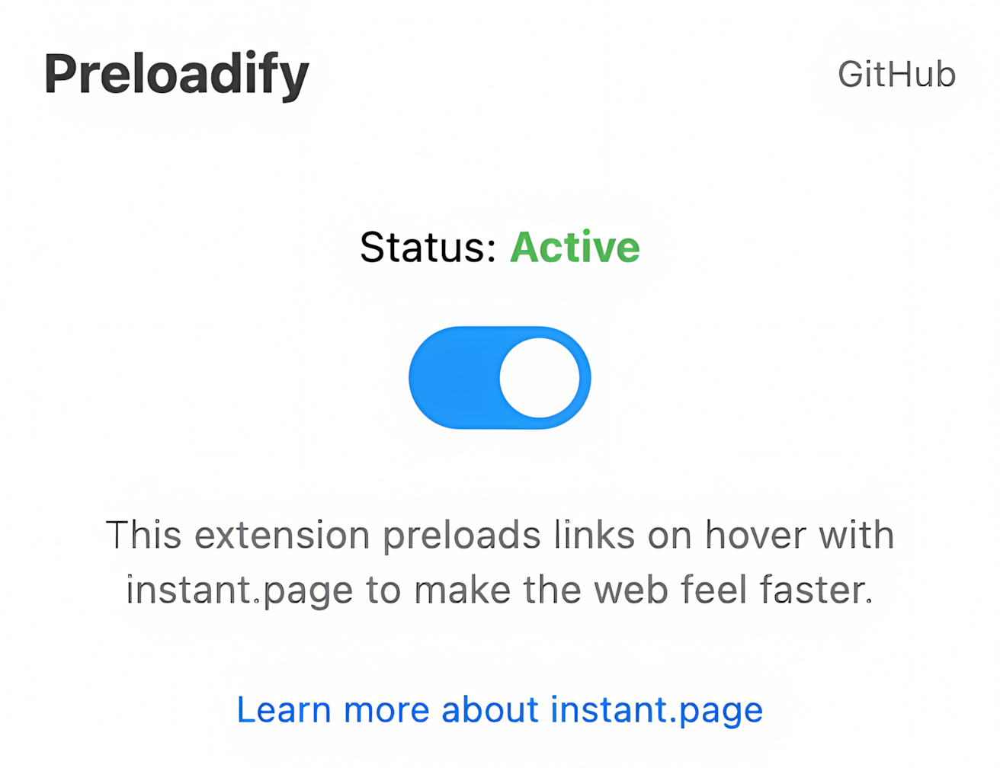

# Preloadify

Preloadify is a browser extension that makes your web browsing feel faster by preloading links when you hover over them.

  

### Features
- **Instant Page Loading**: Preloads links when you hover over them, making them instantly available when you click.
- **Seamless Integration**: Works with all websites without any additional configuration.
- **Lightweight**: Minimal impact on browser performance as it uses the instant.page script locally.

### Installation (Chromium-based browsers)

Supports Chromium-based browsers (Chrome, Edge, Brave, etc.).

1. Download the zip file from the [releases page](https://github.com/1337Core/preloadify/releases)
2. Extract the zip file to a folder on your computer.
3. Open Chrome and navigate to `chrome://extensions`
4. Enable "Developer mode" by toggling the switch in the top right corner.
5. Click on "Load unpacked" and select the extracted Preloadify extension folder.
6. The extension should now be installed and active!

### Usage
- Once installed, Preloadify will automatically start preloading links on hover.
- You can manage the extension by clicking the extension icon in the extension menu.

### Credits
- This extension is [inspired by the extension developed by Simon Frey](https://github.com/simonfrey/faster-pageload-web-extensions).
- [Instant.page script by Alexandre Dieulot](https://dieulot.fr).
- [Rocket icon](https://www.flaticon.com/free-icons/rocket) created by Pixel Perfect - Flaticon.

### License
[MIT License](LICENSE)
